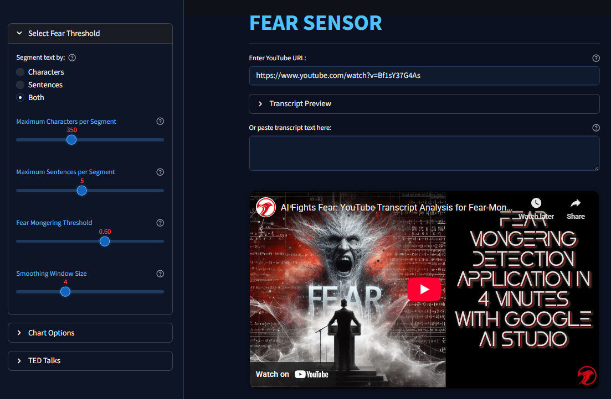

# FearSense: Video Fear-Mongering & Stress Correlation Demo

<!-- This project demonstrates how to detect **fear-mongering in video transcripts** and correlate it with **biometric stress signals** (e.g., heart rate, HRV, EDA) collected from wearables such as Fitbit, Apple Health, or Google Fit. -->

A research platform that detects **fear-mongering patterns in video transcripts** and correlates them with **biometric stress signals** (heart rate, HRV, EDA) from wearables like Fitbit, Apple Health, or Google Fit.

<p align="center">
  
</p>

---

## 🎯Features

* **Multi-source transcript ingestion**: YouTube URLs, manual text input, SRT/VTT subtitles, or MP4 transcription via Whisper.
* **ML-powered fear detection**: NLP pipeline combining emotion classification, zero-shot NLI, and lexical cue analysis.
* **Flexible text segmentation**: Character-based, sentence-based, or hybrid segmentation with adjustable parameters.
* **Biometric data integration**: Fitbit API, Apple Health exports, Google Fit API, or custom CSV uploads.
* **Correlation analytics**: Time-aligned analysis of fear scores and physiological responses.
* **Interactive visualization**: Dual-axis charts, distribution analytics, and downloadable datasets.

---

## 📁Project Structure
```text
fear-monger-detector/
│
├── demos/                          # Demo scripts and Jupyter notebooks
├── docs/                           # Architecture diagrams and documentation
├── src/
│   ├── backend/
│   │   ├── fear_monger_processor/  # Fear detection NLP pipeline
│   │   │   ├── model.py           # Model loading and caching
│   │   │   ├── inference.py       # Batch prediction
│   │   │   ├── transcript.py      # YouTube transcript fetching
│   │   │   └── utils.py           # Segmentation and analysis
│   │   ├── fitbit_app/             # Fitbit ingestion and alignment
│   │   │   ├── fitbit_client.py   # OAuth2 + API calls
│   │   │   ├── fitbit_utils.py    # Data processing
│   │   │   └── aligner.py         # Time-based correlation
│   │   └── ted_talks_app/          # TED transcript database
│   │       └── data_loader.py     # CSV loader with metadata
│   └── frontend/
│       └── correlation_engine/     # Streamlit application
│           ├── app.py             # Main UI
│           ├── config.py          # Configuration constants
│           └── styles.css         # Custom styling
├── assets/                         # Images and media for documentation
├── requirements.txt                # Python dependencies
├── .env                   # Environment variable template
└── README.md
```

---

## 🏗️Architecture

<p align="center">
  
</p>

* **Backend**: FastAPI + Celery for async processing
* **Storage**: Postgres/TimescaleDB + MinIO (object storage)
* **ML/NLP**: [Falconsai/fear_mongering_detection](https://huggingface.co/Falconsai/fear_mongering_detection)
* **Frontend**: Streamlit (MVP) or Next.js (scalable)
* **APIs**: Fitbit Web API, YouTube Transcript API
* **Visualization**: Plotly, Matplotlib


---
## Workflow

**Pipeline**: Video Transcript → NLP Fear Score → Alignment with Biometric Data → Analytics → Visualization

### Dual-Stream Fear & Heart Rate Workflow
| **Fear Analysis Stream**         | **Heart Rate Stream (Fitbit)** | **Merged Correlation**          |
| -------------------------------- | ------------------------------ | ------------------------------- |
| Transcript text / SRT/VTT        | Raw heart rate readings        | Align by playback window        |
| Segment text → **fear_score**    | Trim to selected time window   | Merge on **relative** timestamp |
| Normalize **fear_score** (0 → 1) | Normalize heart rate (0 → 1)   | Plotly chart: fear vs heart     |
| Summary metrics & CSV            | Chart & CSV                    | Correlation stats & CSV         |

---

## Example Insights

* Fear intensity timeline with highlighted transcript segments.
* Overlay of heart rate/HRV against fear spikes.
* Lagged cross-correlation plots to see if fear spikes precede stress responses.

<!--  -->

<p align="center">
  
</p>

---

## 🚀 Getting Started

### Prerequisites

* Python 3.10+
* Docker & docker-compose (for running services)
* Fitbit/Google API credentials (if using live connectors)

---

### 📦Installation
```bash
# Clone repository
git clone https://github.com/your-org/fear-monger-detector.git
cd fear-monger-detector

# Create virtual environment
python -m venv .venv
source .venv/bin/activate   # Linux/macOS
# .venv\Scripts\activate    # Windows

# Install dependencies
pip install -r requirements.txt

# Setup environment variables
cp .env.example .env
# Edit .env with your Fitbit credentials
```

### Required Environment Variables
```bash
# .env file
FITBIT_CLIENT_ID=your_client_id_here
FITBIT_CLIENT_SECRET=your_client_secret_here
FITBIT_REDIRECT_URI=http://localhost:8080/callback
```
---

## Running the Demo
<p style="font-size:16px;">
This guide demonstrates how to analyze a video transcript to detect fear-mongering and correlate the results with biometric stress data, such as heart rate from a Fitbit device.
</p>

---
1️⃣ Launch the Application

1. Navigate to the app:
```bash
cd src/frontend/correlation_engine
streamlit run app.py
```

<p style="font-size:14px;"> The app will open in your browser at http://localhost:8501 </p>

---

2️⃣ Run Fear Analysis

Option A: YouTube Video

1. Paste a YouTube URL into the input field
2. The transcript will be fetched automatically
3. Preview appears in the "Transcript Preview" expander

Option B: Manual Input
1. Paste transcript text into the text area
2. Text is immediately ready for analysis

Option C: TED Talks Database
1. Open the TED Talks sidebar expander
2. Sort by title, views, date, or duration
3. Navigate pages and select a talk
4. Click to analyze

---
### Configuration Options

#### Segmentation Settings (Sidebar)
* **Segment Mode**: Characters | Sentences | Both
* **Max Characters**: 200-600 (default: 400)
* **Max Sentences**s: 1-10 (default: 5)

### Analysis Parameters
* **Fear Threshold**: 0.0-1.0 (default: 0.7)
  - Scores above threshold = high risk
* **Smoothing Window**: 1-10 segments (default: 3)
  - Reduces noise in timeline

### Chart Options
* **Type**: Line | Bar | Area chart
* **Hover Length**: 20-500 characters (default: 30)

---
### Analysis Output

#### ✅ Quick Summary
- **Total paragraphs analyzed**
- **Average fear score vs. threshold**
- **Peak score and minimum score**
- **High-risk segment count and percentage**

#### ✅ Overall Assessment (Color-coded)
- 🔴 **High Risk**: Average score ≥ threshold  
- 🟡 **Moderate**: 0.5 ≤ Average score < threshold  
- 🟢 **Low Risk**: Average score < 0.5  

#### ✅ Visualizations
- **Distribution pie chart** (Low / Medium / High)  
- **Interactive timeline chart** (Line / Bar / Area)  
- **Paragraph-level analysis table**

#### ✅ Downloads
- **CSV export** with all scores and timestamps
CSV export with all scores and timestamps


---
### 3️⃣ Load Fitbit Heart Rate Data

**Prerequisites**
- Fitbit account with intraday heart rate data enabled
- Completed OAuth2 authentication (first-time setup)
- Heart rate data recorded on the target date

**Steps**
1. Navigate to the **Fitbit Heart Rate Data** section
2. Select the date using the date picker
3. Click the **Load Data** button
4. Wait for the API response (≈5–10 seconds)
5. View the heart rate chart for the full day

**Troubleshooting**

- **"No data available"**
  - Ensure you wore your Fitbit device that day
  - Check that heart rate tracking was enabled
  - Verify OAuth2 token hasn't expired

- **"Invalid credentials"**
  - Re-run OAuth2 flow
  - Check `.env` file for correct client ID/secret

---

### 4️⃣ Align Fear & Heart Rate Streams

**Setup Playback Window**
1. Navigate to **Fear vs. Heart Rate Analysis**
2. Configure the time window:
   - **Start Time**: HH:MM when you started watching
   - **Duration**: Minutes of video playback (1–30)
3. Click **Load Fitbit vs Heart Data**

---
**What Happens Next 🔄 Alignment Process**
- Fetch Fitbit data for the specified window (1-min resolution)
- Map transcript segments to relative timestamps
- Interpolate fear scores to match heart rate frequency
- Normalize both streams (0 → 1) for comparison
- Merge datasets on aligned timestamps

**📊 Output**
- **Dual-axis chart**: Fear score (line) + heart rate (bars)
- **Summary metrics**:
  - Average fear score
  - Average heart rate (bpm)
  - Number of aligned data points
- **Aligned data table**: Preview first 20 rows
- **CSV download**: Full merged dataset

**Use Cases**
- Identify if fear spikes correlate with heart rate increases
- Detect delayed physiological responses (lag analysis)
- Compare emotional content with objective stress markers
- Export data for custom statistical analysis in R/Python

---

### 5️⃣ Quick Tips & Best Practices

**✅ Transcript Quality**
- Use complete transcripts with proper punctuation
- Verify timestamps are accurate
- Remove non-verbal annotations like `[music]` or `[applause]`

**✅ Fitbit Integration**
- Ensure intraday API access is enabled
- Wear the device continuously during playback
- Sync Fitbit before fetching data

**✅ Analysis Parameters**
- Start with the default threshold (0.7) and adjust as needed
- Use smoothing for noisy transcripts
- Compare multiple videos to establish baseline patterns

**✅ Correlation Interpretation**
- Correlation ≠ causation
- Account for individual baseline differences
- Consider confounding factors (e.g., caffeine, stress, environment)

---

### 📊 Sample Use Cases

**Research Applications**
- **Media Studies:** Quantify fear-mongering in news coverage  
- **Psychology:** Study emotional responses to persuasive content  
- **Public Health:** Analyze stress responses to health messaging  
- **Education:** Teach critical media literacy with objective metrics  

**Personal Use**
- **Self-awareness:** Track emotional responses to media consumption  
- **Content Curation:** Identify high-stress content to avoid  
- **Mindfulness:** Correlate media habits with physiological stress  


### 🔮 Future Improvements

**Code Quality (Priority: High)**
- Refactor `app.py` into modular components  
- Add comprehensive unit tests (`pytest`)  
- Implement type hints throughout  
- Setup CI/CD pipeline (GitHub Actions)  
- Add logging and error tracking (Sentry)  

**Features (Priority: Medium)**
- Multi-video batch analysis  
- Apple Health integration  
- Google Fit API support  
- Export to PDF reports  
- Real-time streaming analysis  
- Multi-language support (non-English transcripts)  

**ML Improvements (Priority: Medium)**
- Fine-tune model on domain-specific data  
- Add explainability (LIME/SHAP)  
- Emotion classification (fear, anger, sadness, joy)  
- Stance detection (pro/anti topics)  

**Infrastructure (Priority: Low)**
- Migrate to FastAPI backend  
- Setup PostgreSQL + TimescaleDB  
- Add Redis caching layer  
- Implement Celery task queue  
- Deploy with Docker Compose  
- Production-ready Next.js frontend  

---
## ⚠️ Disclaimer

### Important Limitations:
This project is for **research, educational, and demonstration purposes only**. It is not a medical device and does not provide medical advice. Correlation does not imply causation. Results should not be used to make health-related decisions. Individual physiological responses vary significantly

### Ethical Considerations:
- Use responsibly and transparently
- Respect privacy when analyzing content
- Consider potential biases in training data
- Do not use for surveillance or manipulation
---

## License

MIT License. See [LICENSE](LICENSE) for details.

---

## Contributing

Pull requests are welcome! For major changes, please open an issue first to discuss what you’d like to change.

---


