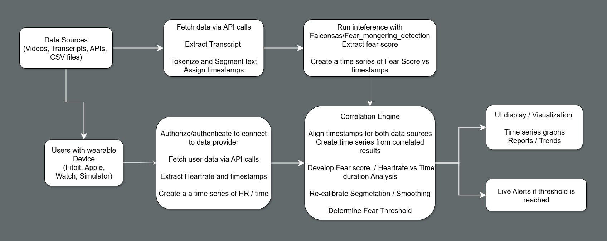

# FearSense: Video Fear-Mongering & Stress Correlation Demo

This project demonstrates how to detect **fear-mongering in video transcripts** and correlate it with **biometric stress signals** (e.g., heart rate, HRV, EDA) collected from wearables such as Fitbit, Apple Health, or Google Fit.

<p align="center">
  
</p>

---

## Features

* **Transcript ingestion**: Upload subtitles (SRT/VTT) or transcribe MP4 videos with Whisper.
* **Fear-mongering detection**: NLP pipeline combining emotion classification, zero-shot NLI, and lexical cue analysis.
* **Biometric integration**: Import data via Fitbit API, Apple Health export, Google Fit API, or CSV.
* **Correlation analytics**: Aligns transcript segments with biometric data to explore correlations.
* **Interactive visualization**: Overlays fear intensity and stress signals on a timeline, with lagged cross-correlation plots.

---

## Architecture

<!-- ```
Video Transcript → NLP Fear Score → Alignment → Analytics → Visualization
                    ↑                        ↑
        Biometrics (Fitbit/Apple/Google/CSV) │
``` -->

<!--  -->

<p align="center">
  
</p>

* **Backend**: FastAPI + Celery for async processing
* **Storage**: Postgres/TimescaleDB + MinIO (object storage)
* **NLP**: [Falconsai/fear_mongering_detection](https://huggingface.co/Falconsai/fear_mongering_detection)
* **Frontend**: Streamlit (MVP) or Next.js (scalable)

---

## Example Insights

* Fear intensity timeline with highlighted transcript segments.
* Overlay of heart rate/HRV against fear spikes.
* Lagged cross-correlation plots to see if fear spikes precede stress responses.

<!--  -->

<p align="center">
  
</p>

---

## 🚀 Getting Started

### Prerequisites

* Python 3.10+
* Docker & docker-compose (for running services)
* Fitbit/Google API credentials (if using live connectors)

---

## ⚠️ Disclaimer

This project is for **research and demo purposes only**. It is not a medical device and does not provide medical advice. Correlation does not imply causation.

---

## License

MIT License. See [LICENSE](LICENSE) for details.

---

## Contributing

Pull requests are welcome! For major changes, please open an issue first to discuss what you’d like to change.

---


